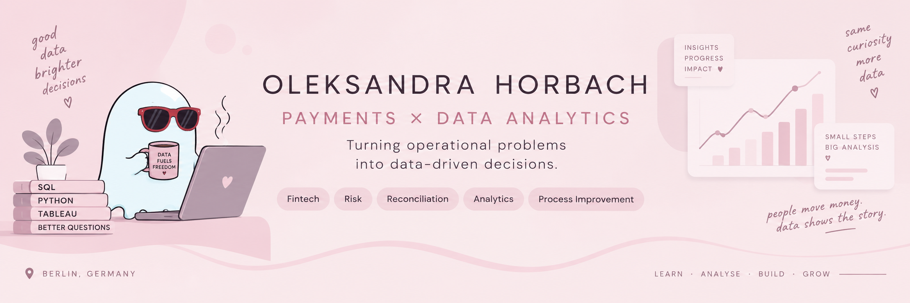
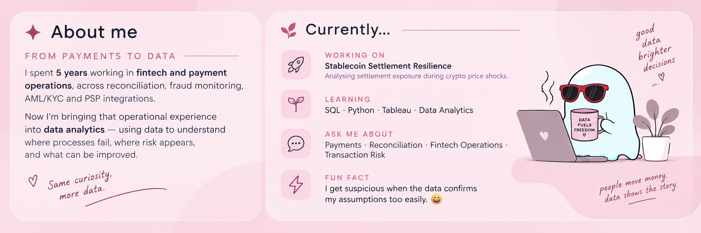

  

 

  

 

## ✦ Tech stack

### Analytics & Data

### Tools & Workflow

 

<h2 align="center">✦ Selected work</h2>

<table>
<tr>
<td width="50%" valign="top">

### 💳 Reconciliation Toolkit

**Operational analytics for reconciliation & transaction risk monitoring**

</td>

<td width="50%" valign="top">

### 🪙 Stablecoin Settlement Resilience

**Settlement exposure during crypto market shocks**

</td>
</tr>

<tr>
<td width="50%" valign="top">

A data pipeline designed to identify reconciliation exceptions, prioritise transaction reviews and turn operational data into actionable insights.

</td>

<td width="50%" valign="top">

Exploring how crypto price shocks and settlement timing can affect financial exposure in payment operations.

</td>
</tr>

<tr>
<td width="50%" valign="top">

`Python` `SQL` `dbt` `DuckDB` `Tableau`

</td>

<td width="50%" valign="top">

`Python` `SQL` `Data Analysis`

</td>
</tr>

<tr>
<td width="50%" valign="bottom">

**[Explore the project →](https://github.com/AleksVervol/reconciliation_toolkit)**

</td>

<td width="50%" valign="bottom">

**[Explore the project →](https://github.com/AleksVervol/stablecoin_settlement_resilience)**

</td>
</tr>
</table>

<h2 align="center">✦ What I care about</h2>

  💳 <b>Payments & Fintech</b> — Understanding how money moves
  &nbsp;&nbsp;&nbsp;&nbsp;&nbsp;&nbsp;
  🔍 <b>Reconciliation & Risk</b> — Finding mismatches and their causes

  📊 <b>Operational Analytics</b> — Turning data into decisions
  &nbsp;&nbsp;&nbsp;&nbsp;&nbsp;&nbsp;
  ⚙️ <b>Process Improvement</b> — Using evidence over assumptions

## ✦ Let's connect

&nbsp;

  

